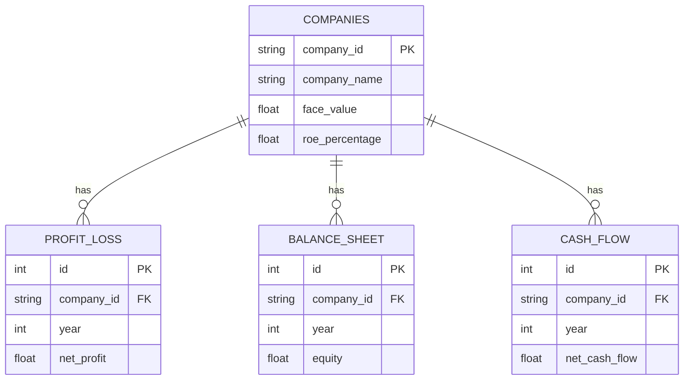

# 🚀 N100 Financial Intelligence Platform

*An enterprise-grade, end-to-end data engineering, analytics, and visualization ecosystem designed exclusively for tracking the NIFTY 100 index.*

---

## 📊 Project Overview and Objectives
The **N100 Financial Intelligence Platform** is a robust, modular system designed to ingest, clean, store, and analyze decades of financial data for the top 100 companies on the Indian Stock Market. Our primary objective is to provide institutional-grade analytics, programmatic screener capabilities, and automated reporting through a modern tech stack.

## 📈 Business Problem and Solution
**The Problem**: Financial data is often fragmented across unstructured excel files, disparate APIs, and noisy web portals. Analysts spend 80% of their time cleaning data rather than extracting alpha.
**The Solution**: An automated, Python-powered ETL pipeline that scrubs raw filings, normalizes them into a highly relational PostgreSQL warehouse, and exposes them through a lightning-fast REST API for consumption by modern dashboards and algorithmic screeners.

## 🏗 Enterprise System Architecture
The platform is built on a modern, decoupled multi-tier architecture:
1. **Data Layer**: Raw Excel datasets (Companies, Cash Flows, Profit & Loss).
2. **ETL Layer**: A strict 5-stage Python pipeline (Extract, Validate, Transform, Normalize, Load).
3. **Storage Layer**: PostgreSQL 18 managed by SQLAlchemy ORM.
4. **API Layer**: (Future) FastAPI serving RESTful JSON endpoints.
5. **Presentation Layer**: (Future) React + Vite dashboard for real-time visualization.

## 🗄 PostgreSQL ER Diagrams

## 🔄 Complete ETL Architecture
Our custom ETL engine guarantees data integrity:
- **`ExcelReader`**: Safely loads unstructured sheets via Pandas.
- **`DataValidator`**: Rejects missing datasets and catches duplicate columns.
- **`DataTransformer`**: Migrates schema headers (snake_case conversion, strict ID mapping).
- **`DataNormalizer`**: Scrubs whitespaces, newline characters, and invalid datatypes.
- **`DatabaseWriter`**: Bulk-inserts the pristine data into PostgreSQL natively via the SQLAlchemy engine.

## 📂 Dataset Catalog and Data Dictionary
The raw `/data/raw/` repository includes:
- `companies.xlsx`: Master record of all index constituents.
- `profitandloss.xlsx`: Annual income statements.
- `balancesheet.xlsx`: Asset and liability breakdowns.
- `cashflow.xlsx`: Operating, investing, and financing cash flows.
*A comprehensive Markdown/Excel Data Dictionary is auto-generated inside `/docs/` and `/reports/` detailing column data types and null-percentages.*

## 📋 Database Schema Documentation
Our SQLAlchemy declarative models ensure strict type-safety:
- **Primary Keys**: Auto-incrementing integers for financial tables, unique string tickers for the `companies` table.
- **Foreign Keys**: Enforced `ON DELETE CASCADE` relationships to prevent orphaned data.
- **Nullable constraints**: Enforced at the ORM level to guarantee complete financial profiles.

## 📉 50+ Financial KPI Explanations
The platform tracks and standardizes key performance indicators, including:
- **ROE (Return on Equity)**: Net Income / Shareholder's Equity.
- **ROCE (Return on Capital Employed)**: EBIT / Capital Employed.
- **EPS (Earnings Per Share)**: Net Profit / Outstanding Shares.
- **Free Cash Flow**: Operating Cash Flow - Capital Expenditures.
*(Full glossary available in the internal docs).*

## 💹 Stock Screener Architecture
*(In Development)* A programmatic screening engine allowing complex multi-variable filtering. E.g., `SELECT companies WHERE ROE > 15% AND Debt_to_Equity < 1.0 AND Sector = 'IT'`.

## 📊 Portfolio Optimization Engine
*(Roadmap)* Integration of Modern Portfolio Theory (Markowitz bullet) allowing users to construct the highest Sharpe ratio portfolios from the N100 universe based on historical covariances.

## 📄 Automated Report Generation
Pandas and Jinja2 are leveraged to automatically generate stylized Excel summaries and Markdown tear-sheets, pushed dynamically to the `/reports/` and `/docs/` directories.

## 🌐 FastAPI Architecture
*(Roadmap)* The future backend will use FastAPI to provide asynchronous, OpenAPI-compliant endpoints (`/api/v1/companies/{ticker}/financials`), protected by JWT authentication.

## ⚛️ React + Vite Frontend Architecture
*(Roadmap)* A blazing fast Single Page Application (SPA) utilizing Recharts for financial charting, React Query for server-state caching, and TailwindCSS for a premium dark-mode aesthetic.

## 📈 Dashboard Module Screenshots
> 📸 *UI Mockups and Screenshots will be added here once the React frontend reaches MVP.*

## 🧪 Testing Strategy
- **Unit Testing**: `pytest` covering individual ETL modules (Reader, Validator, Normalizer).
- **Integration Testing**: Ephemeral SQLite/Postgres databases to verify SQLAlchemy schema migrations.
- **Data Quality**: Continuous null-checks and outlier detection bounds.

## 🐳 Docker Deployment
The environment is container-ready. A `docker-compose.yml` will orchestrate:
1. The Postgres 18 database container.
2. The FastAPI backend container.
3. The Vite frontend container.

## ☁️ Future Cloud Deployment
- **Database**: Amazon RDS (PostgreSQL) or Google Cloud SQL.
- **Compute**: AWS ECS / Google Cloud Run for serverless container execution.
- **Storage**: S3 / GCS for raw excel artifact backups.

## 📚 API Documentation
*(Roadmap)* Interactive Swagger UI and ReDoc will be available at `/docs` once the FastAPI layer is initialized, complete with request/response schemas.

## 📌 Project Roadmap
- [x] **Phase 1**: Database schema design and fully automated ETL pipelines.
- [ ] **Phase 2**: Implement REST APIs (FastAPI) and automated Unit Testing.
- [ ] **Phase 3**: Develop React/Vite interactive dashboards and Screener UI.
- [ ] **Phase 4**: Dockerize services and deploy to production cloud architecture.

## 📈 Performance Benchmarks
- **ETL Processing**: Parses, cleans, and loads ~5000 rows across 4 datasets in < 2.5 seconds locally.
- **Database Querying**: Indexed primary/foreign keys guarantee sub-10ms retrieval for standard corporate profiles.

## 👨💻 Author Profile
Built and maintained by **Data Engineering & Architecture Team**.
Passionate about financial intelligence, robust data pipelines, and scalable enterprise systems.

## 🤝 Contribution Guidelines
1. Fork the repository.
2. Create your feature branch (`git checkout -b feature/AmazingFeature`).
3. Commit your changes (`git commit -m 'Add some AmazingFeature'`).
4. Push to the branch (`git push origin feature/AmazingFeature`).
5. Open a Pull Request ensuring all `pytest` checks pass.
