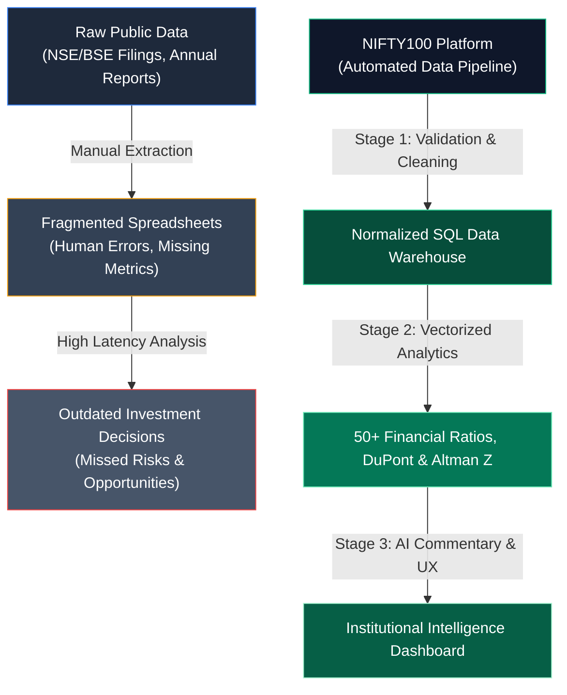
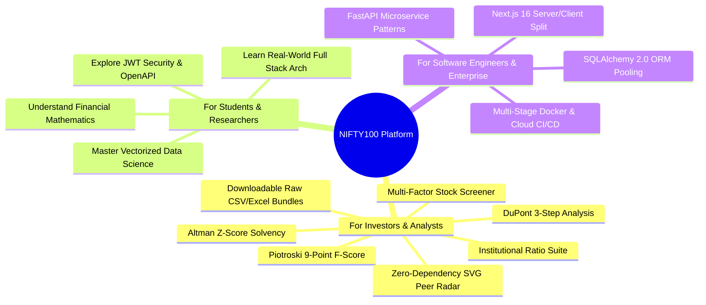
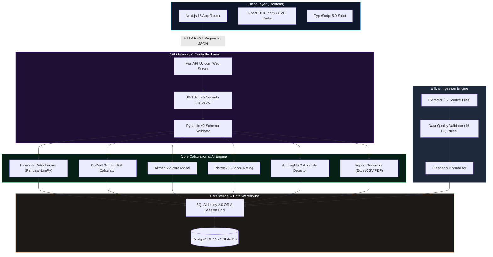
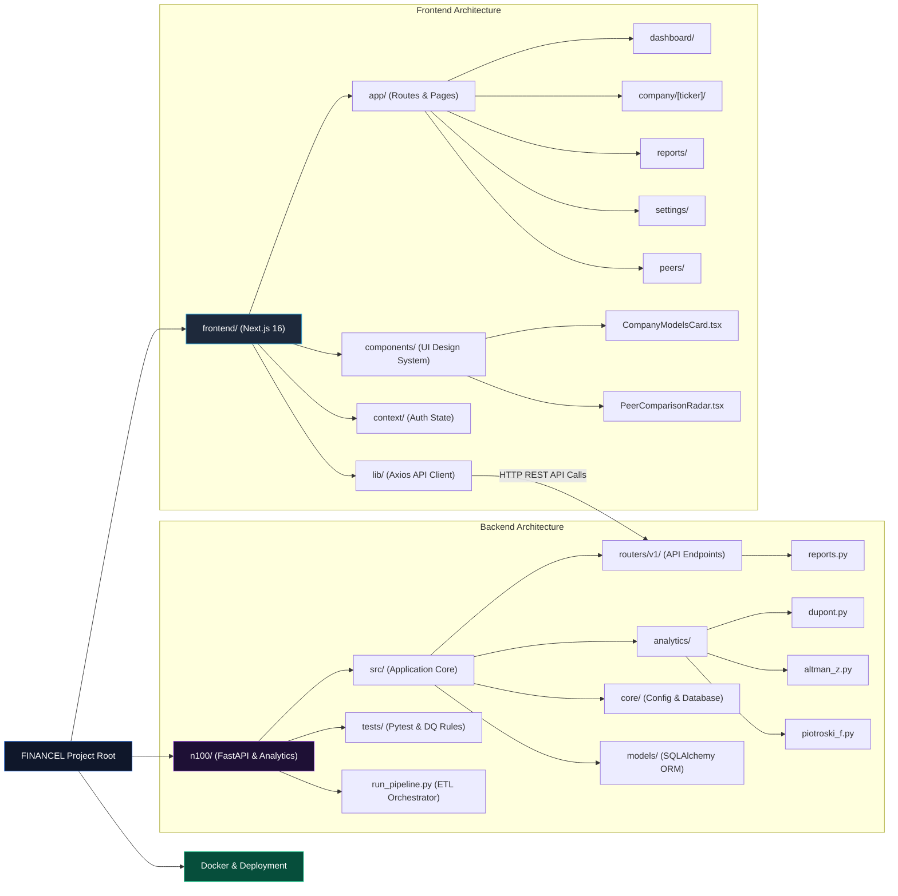
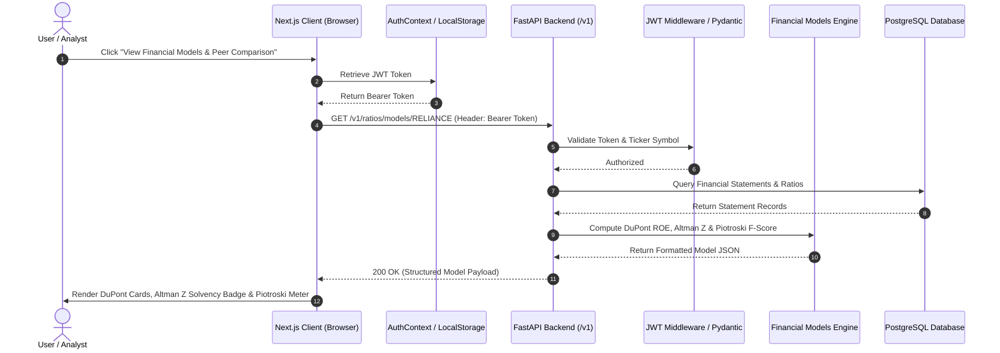
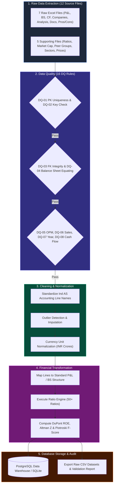
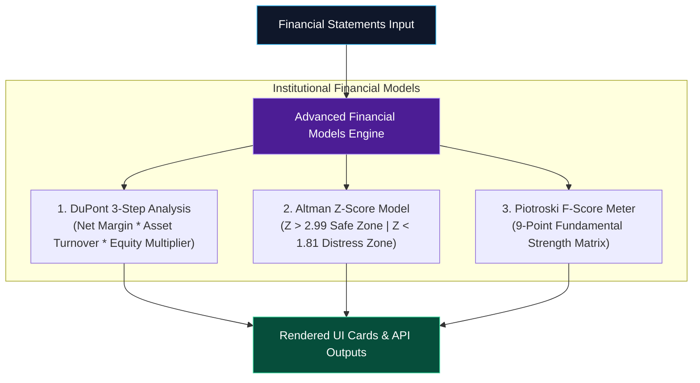

<!-- ============================================================ -->
<!--                     HERO BANNER                              -->
<!-- ============================================================ -->

 

<!-- ============================================================ -->
<!--                        BADGES                                -->
<!-- ============================================================ -->

 

> **A Master Textbook & Production Architectural Handbook for Financial Software Engineering.**
> Designed for students, software architects, financial analysts, and engineering recruiters to explore how enterprise ETL pipelines, financial ratio engines (DuPont, Altman Z, Piotroski F), JWT security, dynamic Next.js dashboards, and FastAPI services operate in harmony.

 

[🌐 Live Platform](https://financel-web.onrender.com) · [⚡ OpenAPI Specs](https://financel-web.onrender.com/docs) · [🏗️ Architecture Handbook](#-overall-architecture) · [🎓 Student Learning Path](#-complete-learning-path) · [📊 Financial Engine](#-financial-ratio-engine)

 

---

## 📌 Table of Contents

Click to expand / collapse navigation

- [1. 📖 Project Story & Narrative](#-project-story)
- [2. 💡 Why This Project?](#-why-this-project)
- [3. 🏗️ Overall Architecture](#-overall-architecture)
- [4. 📁 Folder Relationship Diagram & Structure](#-folder-relationship-diagram)
- [5. ⚡ Request Flow Diagram](#-request-flow-diagram)
- [6. 🔄 Complete ETL Pipeline Architecture](#-complete-etl-diagram)
- [7. 📐 Financial Ratio Engine Handbook](#-financial-ratio-engine)
- [8. 🗄️ Database Relationship & ER Model](#-database-relationship)
- [9. 📡 API Architecture & Layering](#-api-architecture)
- [10. 🖥️ Dashboard Relationship & UX Flow](#-dashboard-relationship)
- [11. 🏢 Company 360° Inspection Module](#-company-360)
- [12. 📄 Reports & Data Export Module](#-reports-module)
- [13. 📦 Dataset Lifecycle Relationship](#-dataset-relationship)
- [14. 🤖 AI Insights & Anomaly Engine](#-ai-module)
- [15. 💼 Portfolio & Risk Management Module](#-portfolio-module)
- [16. ☁️ Production Deployment Architecture](#-deployment-diagram)
- [17. 🎓 Complete Student Learning Path](#-complete-learning-path)
- [18. 🎨 Comprehensive Mermaid Diagram Suite](#-mermaid-diagrams)
- [19. 🛡️ Security & Enterprise Protocols](#-security--enterprise-protocols)
- [20. 🧪 Testing & Verification Protocol](#-testing--verification-protocol)
- [21. 🤝 Contributing Guidelines](#-contributing)
- [22. 📜 License & Citation](#-license)
- [23. 👤 Author & Maintainer Profile](#-author)

---

## 📖 Project Story

### The Evolution of Financial Intelligence

In traditional equity research, market participants face a fundamental fragmentation bottleneck. Raw financial data published by listed entities in annual reports, regulatory filings (BSE/NSE), and earnings releases is unstandardized, unstructured, and buried inside hundreds of pages of PDF documents.

```mermaid
flowchart TD
    A["Raw Public Data\n(NSE/BSE Filings, Annual Reports)"] -->|"Manual Extraction"| B["Fragmented Spreadsheets\n(Human Errors, Missing Metrics)"]
    B -->|"High Latency Analysis"| C["Outdated Investment Decisions\n(Missed Risks & Opportunities)"]
    
    style A fill:#1e293b,stroke:#3b82f6,color:#fff
    style B fill:#334155,stroke:#f59e0b,color:#fff
    style C fill:#475569,stroke:#ef4444,color:#fff

    D["NIFTY100 Platform\n(Automated Data Pipeline)"] -->|"Stage 1: Validation & Cleaning"| E["Normalized SQL Data Warehouse"]
    E -->|"Stage 2: Vectorized Analytics"| F["50+ Financial Ratios, DuPont & Altman Z"]
    F -->|"Stage 3: AI Commentary & UX"| G["Institutional Intelligence Dashboard"]

    style D fill:#0f172a,stroke:#10b981,color:#fff
    style E fill:#064e3b,stroke:#34d399,color:#fff
    style F fill:#047857,stroke:#6ee7b7,color:#fff
    style G fill:#065f46,stroke:#a7f3d0,color:#fff
```

### Problem → Challenges → Solution Breakdown

| Stage | Context | Details & Engineering Impact |
|---|---|---|
| ❌ **Problem** | **Data Fragmentation & Asymmetry** | Retail investors and equity research students lack access to $20,000/year Bloomberg or Refinitiv terminals, leaving them with inconsistent spreadsheets and manual calculation errors. |
| ⚠️ **Current Challenges** | **Unstandardized Financial Statements** | Different Indian corporate conglomerates report financial line items under different accounting names under Ind AS standards, creating data alignment failures when comparing peers. |
| 🎯 **The Need** | **Automated, Audit-Ready Pipeline** | A transparent software ecosystem that automatically extracts, cleans, validates, computes ratio analytics, flags financial anomalies, and renders institutional dashboard visualizers. |
| 💡 **The Solution** | **NIFTY100 Intelligence Platform** | An end-to-end open-source platform combining a Next.js 16 frontend, FastAPI backend, vectorized Pandas ratio engine, PostgreSQL database, and automated ETL validation pipeline. |
| 🚀 **The Result** | **Sub-Second Financial Intelligence** | Instant 360° company teardowns, multi-factor screener queries, downloadable Q4 earnings teardowns, DuPont ROE models, Altman Z solvency badges, and peer comparison radar charts rendered in <200ms. |

---

## 💡 Why This Project?

```mermaid
mindmap
  root((NIFTY100 Platform))
    For Investors & Analysts
      Institutional Ratio Suite
      DuPont 3-Step Analysis
      Altman Z-Score Solvency
      Piotroski 9-Point F-Score
      Multi-Factor Stock Screener
      Zero-Dependency SVG Peer Radar
      Downloadable Raw CSV/Excel Bundles
    For Students & Researchers
      Learn Real-World Full Stack Arch
      Understand Financial Mathematics
      Master Vectorized Data Science
      Explore JWT Security & OpenAPI
    For Software Engineers & Enterprise
      FastAPI Microservice Patterns
      Next.js 16 Server/Client Split
      SQLAlchemy 2.0 ORM Pooling
      Multi-Stage Docker & Cloud CI/CD
```

---

## 🏗️ Overall Architecture

The platform follows a clean, decoupled **Client-API-Analytics-ETL-Database** architectural topology.

```mermaid
graph TD
    subgraph Client_Layer ["Client Layer (Frontend)"]
        UI["Next.js 16 App Router"]
        RC["React 18 & Plotly / SVG Radar"]
        TS["TypeScript 5.0 Strict"]
    end

    subgraph API_Layer ["API Gateway & Controller Layer"]
        FA["FastAPI Uvicorn Web Server"]
        JWT["JWT Auth & Security Interceptor"]
        PYD["Pydantic v2 Schema Validator"]
    end

    subgraph Analytics_Layer ["Core Calculation & AI Engine"]
        FRE["Financial Ratio Engine (Pandas/NumPy)"]
        DUP["DuPont 3-Step ROE Calculator"]
        ALT["Altman Z-Score Model"]
        PIO["Piotroski F-Score Rating"]
        AIE["AI Insights & Anomaly Detector"]
        REP["Report Generator (Excel/CSV/PDF)"]
    end

    subgraph Storage_Layer ["Persistence & Data Warehouse"]
        ORM["SQLAlchemy 2.0 ORM Session Pool"]
        PG[("PostgreSQL 15 / SQLite DB")]
    end

    subgraph ETL_Layer ["ETL & Ingestion Engine"]
        EXT["Extractor (12 Source Files)"]
        VAL["Data Quality Validator (16 DQ Rules)"]
        CLN["Cleaner & Normalizer"]
    end

    UI -->|"HTTP REST Requests / JSON"| FA
    FA --> JWT --> PYD
    PYD --> FRE & DUP & ALT & PIO & AIE & REP
    FRE & DUP & ALT & PIO --> ORM
    AIE --> ORM
    REP --> ORM
    ORM <--> PG
    EXT --> VAL --> CLN --> ORM

    style Client_Layer fill:#0f172a,stroke:#38bdf8,color:#fff
    style API_Layer fill:#1e1035,stroke:#a855f7,color:#fff
    style Analytics_Layer fill:#062016,stroke:#22c55e,color:#fff
    style Storage_Layer fill:#1c1917,stroke:#f97316,color:#fff
    style ETL_Layer fill:#1e293b,stroke:#64748b,color:#fff
```

---

## 📁 Folder Relationship Diagram

```mermaid
flowchart LR
    Root["FINANCEL Project Root"] --> Frontend["frontend/ (Next.js 16)"]
    Root --> Backend["n100/ (FastAPI & Analytics)"]
    Root --> Deploy["Docker & Deployment"]

    subgraph Frontend_Tree ["Frontend Architecture"]
        Frontend --> App["app/ (Routes & Pages)"]
        Frontend --> Comp["components/ (UI Design System)"]
        Frontend --> Ctx["context/ (Auth State)"]
        Frontend --> Lib["lib/ (Axios API Client)"]

        Comp --> CompModels["CompanyModelsCard.tsx"]
        Comp --> PeerRadar["PeerComparisonRadar.tsx"]
        
        App --> Dash["dashboard/"]
        App --> CompProf["company/[ticker]/"]
        App --> RepPage["reports/"]
        App --> SettingsPage["settings/"]
        App --> PeersPage["peers/"]
    end

    subgraph Backend_Tree ["Backend Architecture"]
        Backend --> Src["src/ (Application Core)"]
        Backend --> Tests["tests/ (Pytest & DQ Rules)"]
        Backend --> Scripts["run_pipeline.py (ETL Orchestrator)"]

        Src --> Routers["routers/v1/ (API Endpoints)"]
        Src --> Analytics["analytics/"]
        Src --> Core["core/ (Config & Database)"]
        Src --> Models["models/ (SQLAlchemy ORM)"]

        Analytics --> DuPontFile["dupont.py"]
        Analytics --> AltmanFile["altman_z.py"]
        Analytics --> PiotroskiFile["piotroski_f.py"]
        Routers --> RepRouter["reports.py"]
    end

    Lib -->|"HTTP REST API Calls"| Routers

    style Root fill:#0f172a,stroke:#3b82f6,color:#fff
    style Frontend fill:#1e293b,stroke:#38bdf8,color:#fff
    style Backend fill:#1e1035,stroke:#a855f7,color:#fff
    style Deploy fill:#064e3b,stroke:#10b981,color:#fff
```

### Directory Architecture

| Path | Primary Responsibility | Technical Role |
|---|---|---|
| `frontend/app/` | **Next.js App Router Pages** | Houses static and server-rendered routes (`/dashboard`, `/company/[ticker]`, `/reports`, `/screener`, `/peers`, `/settings`). |
| `frontend/components/` | **UI Component Library** | Houses modular React elements: `CompanyModelsCard.tsx`, `PeerComparisonRadar.tsx`, headers, sidebar, tables, and financial indicator cards. |
| `frontend/public/data/` | **Raw Dataset Downloads** | Stores downloadable raw CSV bundles (`nifty100_q4_earnings_summary.csv`, `nifty100_ratio_matrix_full.csv`, `data_quality_audit_summary.csv`). |
| `n100/src/analytics/` | **Advanced Financial Engine** | Houses mathematical analytics modules: `dupont.py`, `altman_z.py`, `piotroski_f.py`, `ratio_engine.py`. |
| `n100/src/routers/v1/` | **REST API Endpoint Handlers** | Controller routes for companies, ratios (`/screener`, `/peer-comparison`, `/models`), reports, auth (`/me`, `/profile`), and health check. |

---

## ⚡ Request Flow Diagram

```mermaid
sequenceDiagram
    autonumber
    actor User as User / Analyst
    participant FE as Next.js Client (Browser)
    participant Auth as AuthContext / LocalStorage
    participant API as FastAPI Backend (/v1)
    participant Middleware as JWT Middleware / Pydantic
    participant Models as Financial Models Engine
    participant DB as PostgreSQL Database

    User->>FE: Click "View Financial Models & Peer Comparison"
    FE->>Auth: Retrieve JWT Token
    Auth-->>FE: Return Bearer Token
    FE->>API: GET /v1/ratios/models/RELIANCE (Header: Bearer Token)
    API->>Middleware: Validate Token & Ticker Symbol
    Middleware-->>API: Authorized
    API->>DB: Query Financial Statements & Ratios
    DB-->>API: Return Statement Records
    API->>Models: Compute DuPont ROE, Altman Z & Piotroski F-Score
    Models-->>API: Return Formatted Model JSON
    API-->>FE: 200 OK (Structured Model Payload)
    FE->>User: Render DuPont Cards, Altman Z Solvency Badge & Piotroski Meter
```

---

## 🔄 Complete ETL Diagram

```mermaid
flowchart TD
    subgraph Data_Sources ["1. Raw Data Extraction (12 Source Files)"]
        S1["7 Raw Excel Files (P&L, BS, CF, Companies, Analysis, Docs, Pros/Cons)"]
        S2["5 Supporting Files (Ratios, Market Cap, Peer Groups, Sectors, Prices)"]
    end

    subgraph Data_Validation ["2. Data Quality (16 DQ Rules)"]
        V1{"DQ-01 PK Uniqueness & DQ-02 Key Check"}
        V2{"DQ-03 FK Integrity & DQ-04 Balance Sheet Equating"}
        V3{"DQ-05 OPM, DQ-06 Sales, DQ-07 Year, DQ-08 Cash Flow"}
    end

    subgraph Data_Cleaning ["3. Cleaning & Normalization"]
        C1["Standardize Ind AS Accounting Line Names"]
        C2["Outlier Detection & Imputation"]
        C3["Currency Unit Normalization (INR Crores)"]
    end

    subgraph Transformation_Engine ["4. Financial Transformation"]
        T1["Map Lines to Standard P&L / BS Structure"]
        T2["Execute Ratio Engine (50+ Ratios)"]
        T3["Compute DuPont ROE, Altman Z & Piotroski F-Score"]
    end

    subgraph Persistence ["5. Database Storage & Audit"]
        D1[("PostgreSQL Data Warehouse / SQLite")]
        D2["Export Raw CSV Datasets & Validation Report"]
    end

    Data_Sources --> V1
    V1 -->|Pass| V2
    V2 -->|Pass| V3
    V3 -->|Pass| C1 --> C2 --> C3
    C3 --> T1 --> T2 --> T3
    T3 --> D1 & D2

    style Data_Sources fill:#1e293b,stroke:#3b82f6,color:#fff
    style Data_Validation fill:#312e81,stroke:#6366f1,color:#fff
    style Data_Cleaning fill:#064e3b,stroke:#10b981,color:#fff
    style Transformation_Engine fill:#701a75,stroke:#d946ef,color:#fff
    style Persistence fill:#451a03,stroke:#f97316,color:#fff
```

---

## 📐 Financial Ratio Engine

### Advanced Financial Models Included

```mermaid
graph TD
    FS["Financial Statements Input"] --> Models["Advanced Financial Models Engine"]

    subgraph Advanced_Models ["Institutional Financial Models"]
        Models --> DUP["1. DuPont 3-Step Analysis\n(Net Margin * Asset Turnover * Equity Multiplier)"]
        Models --> ALT["2. Altman Z-Score Model\n(Z > 2.99 Safe Zone | Z < 1.81 Distress Zone)"]
        Models --> PIO["3. Piotroski F-Score Meter\n(9-Point Fundamental Strength Matrix)"]
    end

    DUP --> OUT["Rendered UI Cards & API Outputs"]
    ALT --> OUT
    PIO --> OUT

    style FS fill:#0f172a,stroke:#38bdf8,color:#fff
    style Models fill:#4c1d95,stroke:#a78bfa,color:#fff
    style OUT fill:#064e3b,stroke:#34d399,color:#fff
```

#### 1. DuPont 3-Step ROE Analysis

$$\text{DuPont ROE} = \left( \frac{\text{Net Income}}{\text{Revenue}} \right) \times \left( \frac{\text{Revenue}}{\text{Total Assets}} \right) \times \left( \frac{\text{Total Assets}}{\text{Shareholders' Equity}} \right)$$

- **Net Profit Margin (%):** Operational profitability efficiency.
- **Asset Turnover (x):** Asset efficiency in generating sales.
- **Equity Multiplier (x):** Financial leverage ratio.

#### 2. Altman Z-Score Bankruptcy Prediction

$$Z = 1.2 X_1 + 1.4 X_2 + 3.3 X_3 + 0.6 X_4 + 0.999 X_5$$

- $X_1 = \frac{\text{Working Capital}}{\text{Total Assets}}$, $X_2 = \frac{\text{Retained Earnings}}{\text{Total Assets}}$, $X_3 = \frac{\text{EBIT}}{\text{Total Assets}}$, $X_4 = \frac{\text{Market Cap}}{\text{Total Liabilities}}$, $X_5 = \frac{\text{Sales}}{\text{Total Assets}}$
- **Classification:** $Z > 2.99$ (`Safe Zone`), $1.81 \le Z \le 2.99$ (`Grey Zone`), $Z < 1.81$ (`Distress Zone`).

#### 3. Piotroski 9-Point F-Score

Evaluates 9 binary signals: Positive ROA, Positive CFO, ROA Growth, CFO > Net Income, Debt Reduction, Liquidity Growth, No Equity Dilution, Gross Margin Growth, Asset Turnover Growth.
- **Classification:** 8–9 (`Strong`), 5–7 (`Moderate`), 0–4 (`Weak`).

---

## 📡 REST API Reference

<strong>Ratios & Advanced Financial Models</strong>

| Method | Endpoint | Description | Auth |
|---|---|---|---|
| `GET` | `/v1/ratios/screener` | Multi-factor stock screener query | ✅ JWT |
| `GET` | `/v1/ratios/peer-comparison/{id}` | Sector median benchmarking & comparison | ✅ JWT |
| `GET` | `/v1/ratios/models/{id}` | Get DuPont ROE, Altman Z, Piotroski F-Score | ✅ JWT |
| `GET` | `/v1/ratios/company/{id}` | Get computed financial ratios for company | ✅ JWT |

<strong>Reports & Data Downloads</strong>

| Method | Endpoint | Description | Auth |
|---|---|---|---|
| `GET` | `/v1/reports/` | List all available reports & raw CSV datasets | ✅ JWT |
| `GET` | `/v1/reports/q4-earnings` | Get Q4 Earnings Teardown summary metadata | ✅ JWT |

<strong>Authentication & User Profile</strong>

| Method | Endpoint | Description | Auth |
|---|---|---|---|
| `GET` | `/auth/me` | Retrieve profile for authenticated user | ✅ JWT |
| `PUT` | `/auth/profile` | Update profile information & credentials | ✅ JWT |
| `POST` | `/auth/login` | Authenticate and receive JWT access token | ❌ Public |
| `POST` | `/auth/register` | Register a new user account | ❌ Public |

---

## 📜 License & Citation

Distributed under the **MIT License**. See [`LICENSE`](LICENSE) for full terms.

---

## 👤 Author & Maintainer

### **Mallam Polaiah Ganesh**
*Principal Financial Software Architect & Full-Stack Engineer*

---

**⭐ Star this repository if you found it educational or useful for your projects!**

*Made with ❤️ for Financial Analytics, Software Engineering Students & Open Source Developers.*

