<div align="center">

<!-- ============================================================ -->
<!--                     HERO BANNER                              -->
<!-- ============================================================ -->


<br/>

<!-- ============================================================ -->
<!--                        BADGES                                -->
<!-- ============================================================ -->

[](https://www.python.org/)
[](https://fastapi.tiangolo.com/)
[](https://nextjs.org/)
[](https://reactjs.org/)
[](https://www.typescriptlang.org/)

[](https://postgresql.org/)
[](https://docker.com/)
[](https://render.com/)
[](LICENSE)
[]()

[](https://github.com/MALLAMPOLAIAHGANESH/n100-financial-intelligence-platform/stargazers)
[](https://github.com/MALLAMPOLAIAHGANESH/n100-financial-intelligence-platform/network/members)
[](https://github.com/MALLAMPOLAIAHGANESH/n100-financial-intelligence-platform/commits/main)
[](https://github.com/MALLAMPOLAIAHGANESH/n100-financial-intelligence-platform/graphs/contributors)
[](https://github.com/MALLAMPOLAIAHGANESH/n100-financial-intelligence-platform/releases)

<br/>

> **A Master Textbook & Production Architectural Handbook for Financial Software Engineering.**
> Designed for students, software architects, financial analysts, and engineering recruiters to explore how enterprise ETL pipelines, financial ratio computation engines, JWT security, dynamic Next.js dashboards, and FastAPI services operate in harmony.

<br/>

[🌐 Live Platform](https://financel-web.onrender.com) · [⚡ OpenAPI Specs](https://financel-web.onrender.com/docs) · [🏗️ Architecture Handbook](#-overall-architecture) · [🎓 Student Learning Path](#-complete-learning-path) · [📊 Financial Engine](#-financial-ratio-engine)

<br/>

</div>

---

## 📌 Table of Contents

<details open>
<summary>Click to expand / collapse navigation</summary>

- [1. 📖 Project Story & Narrative](#-project-story)
- [2. 💡 Why This Project?](#-why-this-project)
- [3. 🏗️ Overall Architecture](#-overall-architecture)
- [4. 📁 Folder Relationship Diagram & Structure](#-folder-relationship-diagram)
- [5. ⚡ Request Flow Diagram](#-request-flow-diagram)
- [6. 🔄 Complete ETL Pipeline Architecture](#-complete-etl-diagram)
- [7. 📐 Financial Ratio Engine Handbook](#-financial-ratio-engine)
- [8. 🗄️ Database Relationship & ER Model](#-database-relationship)
- [9. 📡 API Architecture & Layering](#-api-architecture)
- [10. 🖥️ Dashboard Relationship & UX Flow](#-dashboard-relationship)
- [11. 🏢 Company 360° Inspection Module](#-company-360)
- [12. 📄 Reports & Data Export Module](#-reports-module)
- [13. 📦 Dataset Lifecycle Relationship](#-dataset-relationship)
- [14. 🤖 AI Insights & Anomaly Engine](#-ai-module)
- [15. 💼 Portfolio & Risk Management Module](#-portfolio-module)
- [16. ☁️ Production Deployment Architecture](#-deployment-diagram)
- [17. 🎓 Complete Student Learning Path](#-complete-learning-path)
- [18. 🎨 Comprehensive Mermaid Diagram Suite](#-mermaid-diagrams)
- [19. 🛡️ Security & Enterprise Protocols](#-security--enterprise-protocols)
- [20. 🧪 Testing & Verification Protocol](#-testing--verification-protocol)
- [21. 🤝 Contributing Guidelines](#-contributing)
- [22. 📜 License & Citation](#-license)
- [23. 👤 Author & Maintainer Profile](#-author)

</details>

---

## 📖 Project Story

### The Evolution of Financial Intelligence

In traditional equity research, market participants face a fundamental fragmentation bottleneck. Raw financial data published by listed entities in annual reports, regulatory filings (BSE/NSE), and earnings releases is unstandardized, unstructured, and buried inside hundreds of pages of PDF documents.


```mermaid
flowchart TD
    A["Raw Public Data\n(NSE/BSE Filings, Annual Reports)"] -->|"Manual Extraction"| B["Fragmented Spreadsheets\n(Human Errors, Missing Metrics)"]
    B -->|"High Latency Analysis"| C["Outdated Investment Decisions\n(Missed Risks & Opportunities)"]
    
    style A fill:#1e293b,stroke:#3b82f6,color:#fff
    style B fill:#334155,stroke:#f59e0b,color:#fff
    style C fill:#475569,stroke:#ef4444,color:#fff

    D["NIFTY100 Platform\n(Automated Data Pipeline)"] -->|"Stage 1: Validation & Cleaning"| E["Normalized SQL Data Warehouse"]
    E -->|"Stage 2: Vectorized Analytics"| F["50+ Computed Financial Ratios"]
    F -->|"Stage 3: AI Commentary & UX"| G["Institutional Intelligence Dashboard"]

    style D fill:#0f172a,stroke:#10b981,color:#fff
    style E fill:#064e3b,stroke:#34d399,color:#fff
    style F fill:#047857,stroke:#6ee7b7,color:#fff
    style G fill:#065f46,stroke:#a7f3d0,color:#fff
```

### Problem → Challenges → Solution Breakdown

| Stage | Context | Details & Engineering Impact |
|---|---|---|
| ❌ **Problem** | **Data Fragmentation & Asymmetry** | Retail investors and equity research students lack access to $20,000/year Bloomberg or Refinitiv terminals, leaving them with inconsistent spreadsheets and manual calculation errors. |
| ⚠️ **Current Challenges** | **Unstandardized Financial Statements** | Different Indian corporate conglomerates report financial line items under different accounting names under Ind AS standards, creating data alignment failures when comparing peers. |
| 🎯 **The Need** | **Automated, Audit-Ready Pipeline** | A transparent software ecosystem that automatically extracts, cleans, validates, computes ratio analytics, flags financial anomalies, and renders institutional dashboard visualizers. |
| 💡 **The Solution** | **NIFTY100 Intelligence Platform** | An end-to-end open-source platform combining a Next.js 16 frontend, FastAPI backend, vectorized Pandas ratio engine, PostgreSQL database, and automated ETL validation pipeline. |
| 🚀 **The Result** | **Sub-Second Financial Intelligence** | Instant 360° company teardowns, multi-factor screener queries, downloadable Q4 earnings teardowns, and peer comparison radar charts rendered in <200ms. |

---

## 💡 Why This Project?

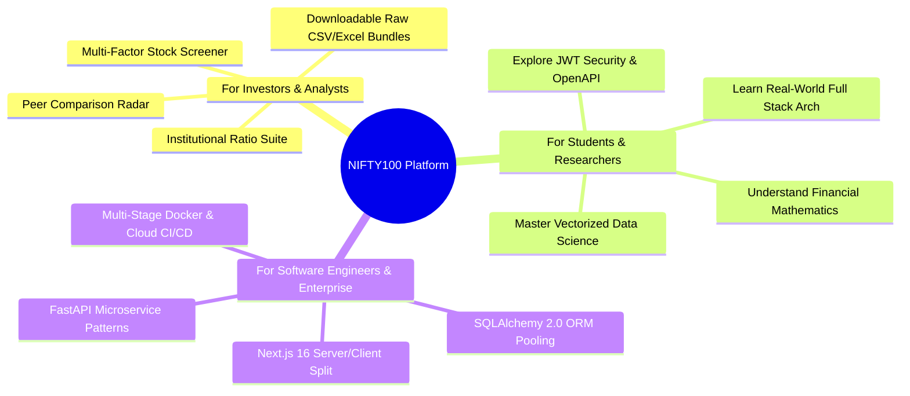
```mermaid
mindmap
  root((NIFTY100 Platform))
    For Investors & Analysts
      Institutional Ratio Suite
      Multi-Factor Stock Screener
      Peer Comparison Radar
      Downloadable Raw CSV/Excel Bundles
    For Students & Researchers
      Learn Real-World Full Stack Arch
      Understand Financial Mathematics
      Master Vectorized Data Science
      Explore JWT Security & OpenAPI
    For Software Engineers & Enterprise
      FastAPI Microservice Patterns
      Next.js 16 Server/Client Split
      SQLAlchemy 2.0 ORM Pooling
      Multi-Stage Docker & Cloud CI/CD
```

### 1. For Investors & Financial Analysts
- **Institutional Depth:** Eliminates superficial metrics by computing 50+ ratios across Profitability, Growth, Liquidity, Leverage, Efficiency, Cash Flow, Valuation, and Altman Z/Piotroski Risk Scores.
- **Peer Benchmarking:** Instantly benchmark any Nifty 100 constituent against its sector median.

### 2. For Computer Science & Finance Students
- **Full-Stack Architecture Mastery:** Demonstrates how clean separation of concerns works between Next.js React components, FastAPI endpoints, and relational databases.
- **Financial Software Mechanics:** Shows how financial formulas (e.g. Dupont Analysis, WACC, FCF Yield) are translated into vectorized Python code using Pandas and NumPy.

### 3. For Enterprise Engineering Teams
- **Reference Implementation:** Serves as a production-grade blueprint for building audit-ready data pipelines, containerized microservices, and high-performance Web dashboards.

---

## 🏗️ Overall Architecture

The platform follows a clean, decoupled **Client-API-Analytics-ETL-Database** architectural topology.

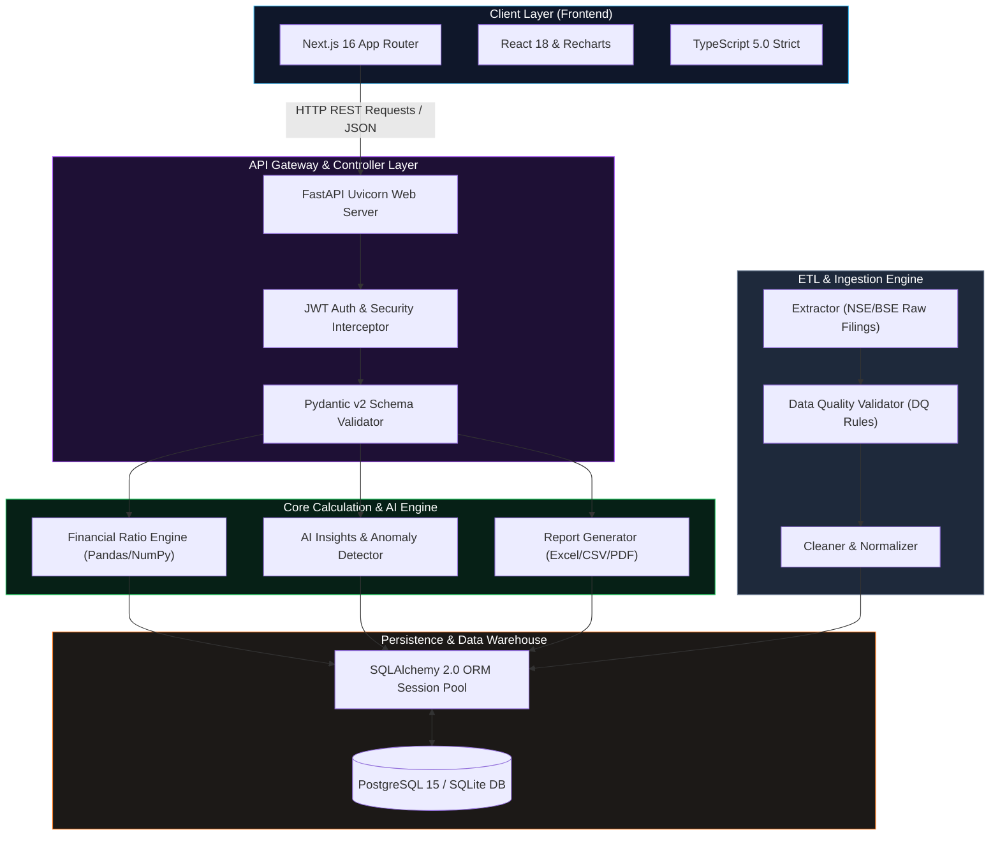
```mermaid
graph TD
    subgraph Client_Layer ["Client Layer (Frontend)"]
        UI["Next.js 16 App Router"]
        RC["React 18 & Recharts"]
        TS["TypeScript 5.0 Strict"]
    end

    subgraph API_Layer ["API Gateway & Controller Layer"]
        FA["FastAPI Uvicorn Web Server"]
        JWT["JWT Auth & Security Interceptor"]
        PYD["Pydantic v2 Schema Validator"]
    end

    subgraph Analytics_Layer ["Core Calculation & AI Engine"]
        FRE["Financial Ratio Engine (Pandas/NumPy)"]
        AIE["AI Insights & Anomaly Detector"]
        REP["Report Generator (Excel/CSV/PDF)"]
    end

    subgraph Storage_Layer ["Persistence & Data Warehouse"]
        ORM["SQLAlchemy 2.0 ORM Session Pool"]
        PG[("PostgreSQL 15 / SQLite DB")]
    end

    subgraph ETL_Layer ["ETL & Ingestion Engine"]
        EXT["Extractor (NSE/BSE Raw Filings)"]
        VAL["Data Quality Validator (DQ Rules)"]
        CLN["Cleaner & Normalizer"]
    end

    UI -->|"HTTP REST Requests / JSON"| FA
    FA --> JWT --> PYD
    PYD --> FRE & AIE & REP
    FRE --> ORM
    AIE --> ORM
    REP --> ORM
    ORM <--> PG
    EXT --> VAL --> CLN --> ORM

    style Client_Layer fill:#0f172a,stroke:#38bdf8,color:#fff
    style API_Layer fill:#1e1035,stroke:#a855f7,color:#fff
    style Analytics_Layer fill:#062016,stroke:#22c55e,color:#fff
    style Storage_Layer fill:#1c1917,stroke:#f97316,color:#fff
    style ETL_Layer fill:#1e293b,stroke:#64748b,color:#fff
```

### Technical Workflow Narrative
1. **User Action:** The client browser initiates a request via the Next.js frontend application.
2. **API Interception:** Axios/Fetch passes the request to the FastAPI server with a Bearer JWT token header.
3. **Validation & Routing:** Pydantic validates input schemas while FastAPI dependency injection verifies authentication credentials.
4. **Analytics Execution:** The `RatioEngine` retrieves financial statements from PostgreSQL/SQLAlchemy, applies matrix operations via Pandas, and computes metric outputs.
5. **JSON Response:** The FastAPI layer serializes structured JSON responses back to the React UI for sub-second rendering.

---

## 📁 Folder Relationship Diagram

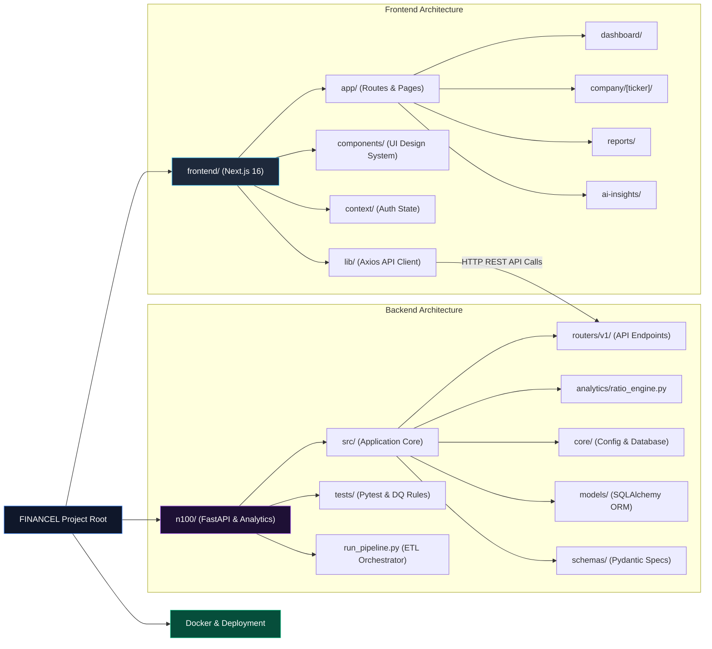
```mermaid
flowchart LR
    Root["FINANCEL Project Root"] --> Frontend["frontend/ (Next.js 16)"]
    Root --> Backend["n100/ (FastAPI & Analytics)"]
    Root --> Deploy["Docker & Deployment"]

    subgraph Frontend_Tree ["Frontend Architecture"]
        Frontend --> App["app/ (Routes & Pages)"]
        Frontend --> Comp["components/ (UI Design System)"]
        Frontend --> Ctx["context/ (Auth State)"]
        Frontend --> Lib["lib/ (Axios API Client)"]
        
        App --> Dash["dashboard/"]
        App --> CompProf["company/[ticker]/"]
        App --> RepPage["reports/"]
        App --> AIInsight["ai-insights/"]
    end

    subgraph Backend_Tree ["Backend Architecture"]
        Backend --> Src["src/ (Application Core)"]
        Backend --> Tests["tests/ (Pytest & DQ Rules)"]
        Backend --> Scripts["run_pipeline.py (ETL Orchestrator)"]

        Src --> Routers["routers/v1/ (API Endpoints)"]
        Src --> Analytics["analytics/ratio_engine.py"]
        Src --> Core["core/ (Config & Database)"]
        Src --> Models["models/ (SQLAlchemy ORM)"]
        Src --> Schemas["schemas/ (Pydantic Specs)"]
    end

    Lib -->|"HTTP REST API Calls"| Routers

    style Root fill:#0f172a,stroke:#3b82f6,color:#fff
    style Frontend fill:#1e293b,stroke:#38bdf8,color:#fff
    style Backend fill:#1e1035,stroke:#a855f7,color:#fff
    style Deploy fill:#064e3b,stroke:#10b981,color:#fff
```

### Comprehensive Directory Explanation

| Path | Primary Responsibility | Technical Role |
|---|---|---|
| `frontend/app/` | **Next.js App Router Pages** | Houses static and server-rendered routes (`/dashboard`, `/company/[ticker]`, `/reports`, `/screener`). |
| `frontend/components/` | **UI Component Library** | Houses modular React elements: charts, headers, sidebar, tables, and financial indicator cards. |
| `frontend/lib/api.ts` | **HTTP Client Gateway** | Axios instance configured with base URLs, request/response interceptors, and automatic JWT bearer attachment. |
| `n100/src/app/main.py` | **FastAPI Application Factory** | Entry point creating the ASGI application, registering CORS middleware, routing v1 endpoints, and setting up OpenAPI docs. |
| `n100/src/routers/v1/` | **REST API Endpoint Handlers** | Controller routes for companies, ratios, auth, reports, and health checks. |
| `n100/src/analytics/ratio_engine.py` | **Financial Calculation Engine** | Vectorized Python class that processes raw financial statement DataFrames into 50+ key financial ratios. |
| `n100/src/models/` | **SQLAlchemy ORM Data Definitions** | Python classes declaring PostgreSQL/SQLite tables (`Companies`, `FinancialStatements`, `FinancialRatios`, `Users`). |
| `n100/run_pipeline.py` | **ETL Pipeline Entry Script** | CLI script that runs raw extraction, data quality validation, ratio computation, and database loading in sequence. |

---

## ⚡ Request Flow Diagram

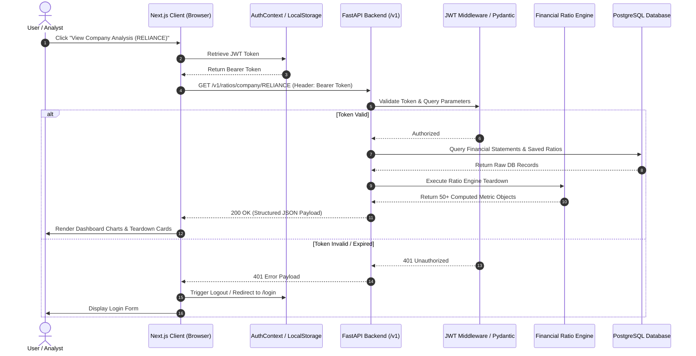
```mermaid
sequenceDiagram
    autonumber
    actor User as User / Analyst
    participant FE as Next.js Client (Browser)
    participant Auth as AuthContext / LocalStorage
    participant API as FastAPI Backend (/v1)
    participant Middleware as JWT Middleware / Pydantic
    participant Engine as Financial Ratio Engine
    participant DB as PostgreSQL Database

    User->>FE: Click "View Company Analysis (RELIANCE)"
    FE->>Auth: Retrieve JWT Token
    Auth-->>FE: Return Bearer Token
    FE->>API: GET /v1/ratios/company/RELIANCE (Header: Bearer Token)
    API->>Middleware: Validate Token & Query Parameters
    alt Token Valid
        Middleware-->>API: Authorized
        API->>DB: Query Financial Statements & Saved Ratios
        DB-->>API: Return Raw DB Records
        API->>Engine: Execute Ratio Engine Teardown
        Engine-->>API: Return 50+ Computed Metric Objects
        API-->>FE: 200 OK (Structured JSON Payload)
        FE->>User: Render Dashboard Charts & Teardown Cards
    else Token Invalid / Expired
        Middleware-->>API: 401 Unauthorized
        API-->>FE: 401 Error Payload
        FE->>Auth: Trigger Logout / Redirect to /login
        FE->>User: Display Login Form
    end
```

### Detailed Execution Steps
1. **User Interaction:** The analyst requests financial details for a company.
2. **Client State Inspection:** The frontend checks `localStorage` for a non-expired JWT.
3. **HTTP Dispatch:** Axios sends a GET request to FastAPI with authorization headers.
4. **Backend Inspection:** FastAPI executes authentication dependency functions before endpoint logic runs.
5. **Database & Engine Operations:** Database queries fetch raw historical statements; Pandas processes mathematical metrics.
6. **UI Hydration:** React state updates trigger Recharts animations and ratio status cards seamlessly.

---

## 🔄 Complete ETL Diagram

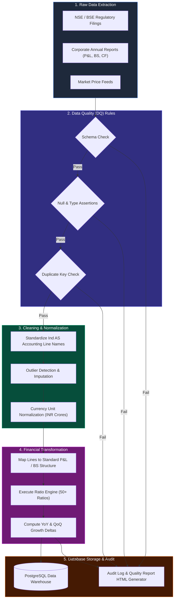
```mermaid
flowchart TD
    subgraph Data_Sources ["1. Raw Data Extraction"]
        S1["NSE / BSE Regulatory Filings"]
        S2["Corporate Annual Reports (P&L, BS, CF)"]
        S3["Market Price Feeds"]
    end

    subgraph Data_Validation ["2. Data Quality (DQ) Rules"]
        V1{"Schema Check"}
        V2{"Null & Type Assertions"}
        V3{"Duplicate Key Check"}
    end

    subgraph Data_Cleaning ["3. Cleaning & Normalization"]
        C1["Standardize Ind AS Accounting Line Names"]
        C2["Outlier Detection & Imputation"]
        C3["Currency Unit Normalization (INR Crores)"]
    end

    subgraph Transformation_Engine ["4. Financial Transformation"]
        T1["Map Lines to Standard P&L / BS Structure"]
        T2["Execute Ratio Engine (50+ Ratios)"]
        T3["Compute YoY & QoQ Growth Deltas"]
    end

    subgraph Persistence ["5. Database Storage & Audit"]
        D1[("PostgreSQL Data Warehouse")]
        D2["Audit Log & Quality Report HTML Generator"]
    end

    Data_Sources --> V1
    V1 -->|Pass| V2
    V2 -->|Pass| V3
    V3 -->|Pass| C1 --> C2 --> C3
    C3 --> T1 --> T2 --> T3
    T3 --> D1 & D2

    V1 -->|Fail| D2
    V2 -->|Fail| D2
    V3 -->|Fail| D2

    style Data_Sources fill:#1e293b,stroke:#3b82f6,color:#fff
    style Data_Validation fill:#312e81,stroke:#6366f1,color:#fff
    style Data_Cleaning fill:#064e3b,stroke:#10b981,color:#fff
    style Transformation_Engine fill:#701a75,stroke:#d946ef,color:#fff
    style Persistence fill:#451a03,stroke:#f97316,color:#fff
```

### Detailed ETL Stage Descriptions
1. **Extraction:** Ingests raw tabular data from corporate balance sheets, profit & loss statements, and cash flow statements.
2. **Validation:** Checks records against stricter Data Quality (DQ) rules defined in `tests/dq/dq_rules.py` (ensuring non-negative assets, valid ticker names, balanced accounting equations).
3. **Cleaning:** Resolves variations in accounting nomenclature across different industries (e.g. aligning "Revenue from Operations" vs "Turnover").
4. **Transformation:** Converts normalized statements into input matrices for the ratio calculation suite.
5. **Loading & Audit:** Commits records into PostgreSQL and generates `data_quality_audit_report.html` for complete compliance logging.

---

## 📐 Financial Ratio Engine

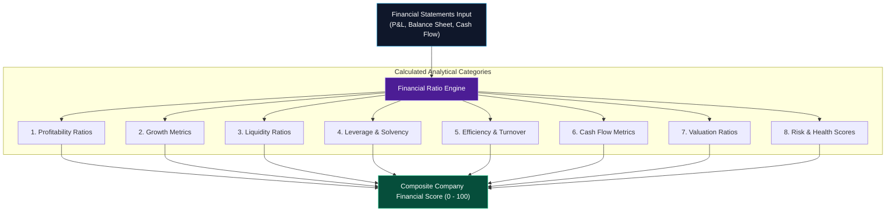
```mermaid
graph TD
    FS["Financial Statements Input\n(P&L, Balance Sheet, Cash Flow)"] --> RE["Financial Ratio Engine"]

    subgraph Ratio_Categories ["Calculated Analytical Categories"]
        RE --> PROF["1. Profitability Ratios"]
        RE --> GROW["2. Growth Metrics"]
        RE --> LIQ["3. Liquidity Ratios"]
        RE --> LEV["4. Leverage & Solvency"]
        RE --> EFF["5. Efficiency & Turnover"]
        RE --> CF["6. Cash Flow Metrics"]
        RE --> VAL["7. Valuation Ratios"]
        RE --> RISK["8. Risk & Health Scores"]
    end

    PROF --> SCORE["Composite Company Financial Score (0 - 100)"]
    GROW --> SCORE
    LIQ --> SCORE
    LEV --> SCORE
    EFF --> SCORE
    CF --> SCORE
    VAL --> SCORE
    RISK --> SCORE

    style FS fill:#0f172a,stroke:#38bdf8,color:#fff
    style RE fill:#4c1d95,stroke:#a78bfa,color:#fff
    style SCORE fill:#064e3b,stroke:#34d399,color:#fff
```

### Complete Ratio Formulas & Business Meaning

#### 1. Profitability Ratios

| Ratio Name | Mathematical Formula | Business & Analytical Meaning |
|---|---|---|
| **Return on Equity (ROE)** | $$\text{ROE} = \frac{\text{Net Income}}{\text{Shareholders' Equity}} \times 100$$ | Measures how efficiently management generates profit from shareholders' invested capital. Industry benchmark: >15%. |
| **Return on Capital Employed (ROCE)** | $$\text{ROCE} = \frac{\text{EBIT}}{\text{Total Assets} - \text{Current Liabilities}} \times 100$$ | Evaluates overall capital efficiency across both equity and debt financing. Essential for capital-intensive sectors. |
| **Net Profit Margin** | $$\text{Net Margin} = \frac{\text{Net Profit after Tax}}{\text{Total Revenue}} \times 100$$ | Percentage of revenue remaining after all operating costs, interest, and taxes are paid. |
| **Operating Profit Margin (OPD)** | $$\text{OP Margin} = \frac{\text{EBIT}}{\text{Total Revenue}} \times 100$$ | Isolates core operational profitability before leverage and tax impacts. |

#### 2. Growth Ratios

| Ratio Name | Mathematical Formula | Business & Analytical Meaning |
|---|---|---|
| **Revenue Growth (YoY)** | $$\text{Rev Growth} = \frac{\text{Revenue}_t - \text{Revenue}_{t-1}}{\text{Revenue}_{t-1}} \times 100$$ | Tracks top-line business expansion year-over-year. |
| **EPS Growth** | $$\text{EPS Growth} = \frac{\text{EPS}_t - \text{EPS}_{t-1}}{\text{EPS}_{t-1}} \times 100$$ | Evaluates bottom-line per-share earning power growth. |

#### 3. Liquidity Ratios

| Ratio Name | Mathematical Formula | Business & Analytical Meaning |
|---|---|---|
| **Current Ratio** | $$\text{Current Ratio} = \frac{\text{Current Assets}}{\text{Current Liabilities}}$$ | Assesses short-term solvency. Indicates ability to cover short-term debts within 12 months. Ideal range: 1.5 - 2.0. |
| **Quick Ratio (Acid-Test)** | $$\text{Quick Ratio} = \frac{\text{Cash} + \text{Marketable Securities} + \text{Receivables}}{\text{Current Liabilities}}$$ | Strict solvency test excluding illiquid inventory. |

#### 4. Leverage Ratios

| Ratio Name | Mathematical Formula | Business & Analytical Meaning |
|---|---|---|
| **Debt to Equity (D/E)** | $$\text{D/E} = \frac{\text{Total Liabilities or Total Debt}}{\text{Total Equity}}$$ | Measures financial leverage and solvency risk. High values (>2.0) indicate financial risk. |
| **Interest Coverage Ratio** | $$\text{Interest Coverage} = \frac{\text{EBIT}}{\text{Interest Expense}}$$ | Number of times operating profit can cover annual debt interest payments. Values < 1.5 signal distress. |

#### 5. Valuation & Risk Metrics

| Ratio Name | Mathematical Formula | Business & Analytical Meaning |
|---|---|---|
| **Price to Earnings (P/E)** | $$\text{P/E} = \frac{\text{Market Price per Share}}{\text{Earnings per Share (EPS)}}$$ | Indicates market valuation multiple relative to current earnings. |
| **Altman Z-Score** | $$Z = 1.2X_1 + 1.4X_2 + 3.3X_3 + 0.6X_4 + 0.999X_5$$ | Quantitative bankruptcy prediction formula. $Z > 2.99$ indicates safe zone, $Z < 1.81$ indicates distress. |

---

## 🗄️ Database Relationship

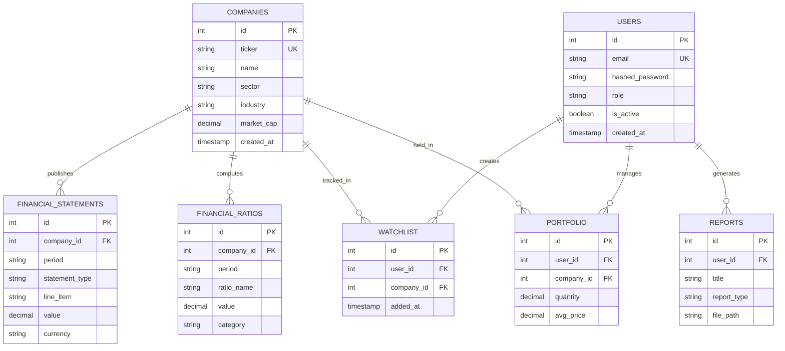
```mermaid
erDiagram
    COMPANIES ||--o{ FINANCIAL_STATEMENTS : "publishes"
    COMPANIES ||--o{ FINANCIAL_RATIOS : "computes"
    COMPANIES ||--o{ WATCHLIST : "tracked_in"
    COMPANIES ||--o{ PORTFOLIO : "held_in"
    USERS ||--o{ WATCHLIST : "creates"
    USERS ||--o{ PORTFOLIO : "manages"
    USERS ||--o{ REPORTS : "generates"

    COMPANIES {
        int id PK
        string ticker UK
        string name
        string sector
        string industry
        decimal market_cap
        timestamp created_at
    }

    FINANCIAL_STATEMENTS {
        int id PK
        int company_id FK
        string period
        string statement_type
        string line_item
        decimal value
        string currency
    }

    FINANCIAL_RATIOS {
        int id PK
        int company_id FK
        string period
        string ratio_name
        decimal value
        string category
    }

    USERS {
        int id PK
        string email UK
        string hashed_password
        string role
        boolean is_active
        timestamp created_at
    }

    PORTFOLIO {
        int id PK
        int user_id FK
        int company_id FK
        decimal quantity
        decimal avg_price
    }

    WATCHLIST {
        int id PK
        int user_id FK
        int company_id FK
        timestamp added_at
    }

    REPORTS {
        int id PK
        int user_id FK
        string title
        string report_type
        string file_path
    }
```

### Relational Integrity & Normalization Rules
- **1st Normal Form (1NF):** Every cell contains atomic values; no repetitive arrays in columns.
- **2nd Normal Form (2NF):** All non-key attributes (`statement_type`, `value`) depend entirely on the composite key context.
- **3rd Normal Form (3NF):** Non-key fields do not depend on other non-key fields. Company demographics (`sector`, `industry`) reside exclusively in `COMPANIES`.
- **Foreign Key Constraints:** Cascading deletions and foreign key references ensure data consistency across `FINANCIAL_RATIOS` and `COMPANIES`.

---

## 📡 API Architecture

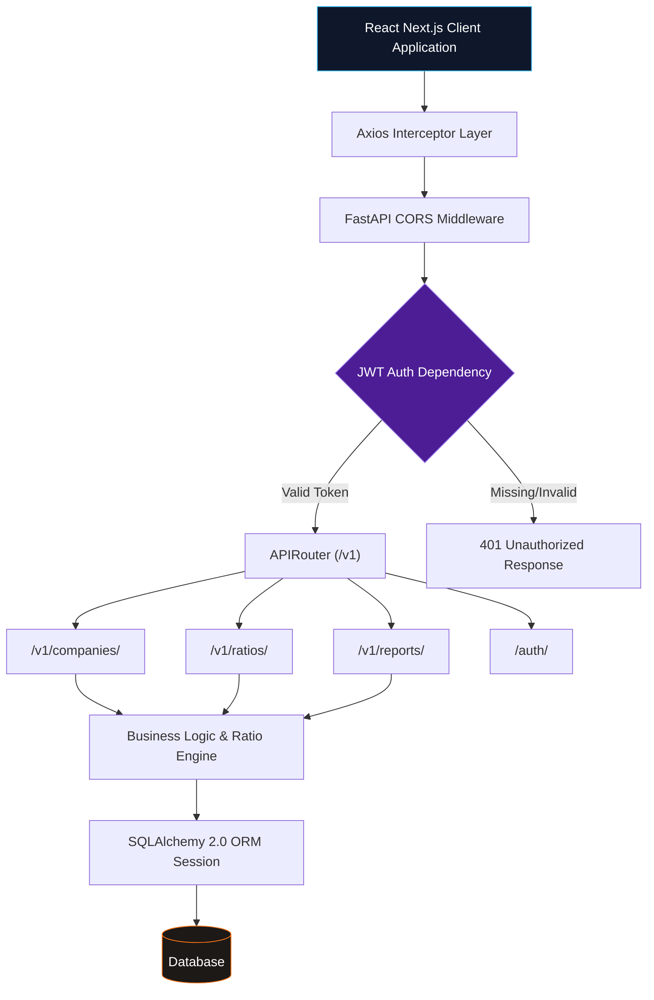
```mermaid
graph TD
    Client["React Next.js Client Application"] --> Axios["Axios Interceptor Layer"]
    Axios --> Cors["FastAPI CORS Middleware"]
    Cors --> AuthGuard{"JWT Auth Dependency"}
    
    AuthGuard -->|Valid Token| Router["APIRouter (/v1)"]
    AuthGuard -->|Missing/Invalid| Err401["401 Unauthorized Response"]

    Router --> CompEp["/v1/companies/"]
    Router --> RatioEp["/v1/ratios/"]
    Router --> RepEp["/v1/reports/"]
    Router --> AuthEp["/auth/"]

    CompEp & RatioEp & RepEp --> Service["Business Logic & Ratio Engine"]
    Service --> ORM["SQLAlchemy 2.0 ORM Session"]
    ORM --> DB[("Database")]

    style Client fill:#0f172a,stroke:#38bdf8,color:#fff
    style AuthGuard fill:#4c1d95,stroke:#a78bfa,color:#fff
    style DB fill:#1c1917,stroke:#f97316,color:#fff
```

### Layer Responsibilities Explained
1. **Axios Interceptor Layer:** Automatically attaches `Authorization: Bearer <token>` headers to outgoing requests and catches global 401 response statuses to prompt user re-login.
2. **CORS Middleware:** Grants or restricts cross-origin HTTP requests depending on environment configuration (`NEXT_PUBLIC_API_URL`).
3. **JWT Auth Dependency:** Intercepts requests using FastAPI's `Depends(get_current_user)` injection to parse cryptographic JWT tokens.
4. **Router & Service Layer:** Decouples endpoint parameter parsing from raw calculation math, allowing re-use of calculation routines across CLI, REST, and background task drivers.

---

## 🖥️ Dashboard Relationship

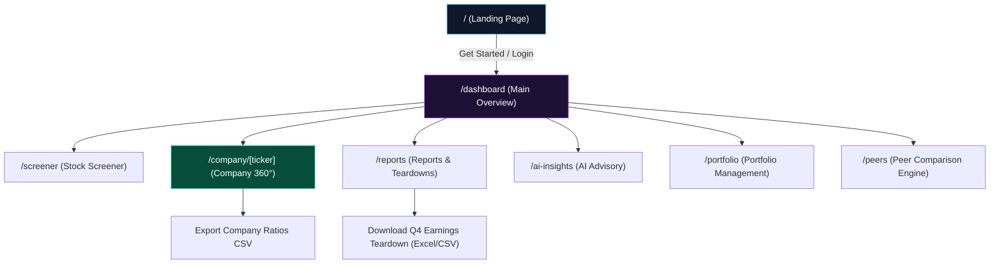
```mermaid
flowchart TD
    Landing["/ (Landing Page)"] -->|Get Started / Login| Dash["/dashboard (Main Overview)"]
    
    Dash --> Screener["/screener (Stock Screener)"]
    Dash --> CompProfile["/company/[ticker] (Company 360°)"]
    Dash --> ReportsPage["/reports (Reports & Teardowns)"]
    Dash --> AIInsights["/ai-insights (AI Advisory)"]
    Dash --> PortfolioPage["/portfolio (Portfolio Management)"]
    Dash --> PeersPage["/peers (Peer Comparison Engine)"]

    CompProfile --> ExportCSV["Export Company Ratios CSV"]
    ReportsPage --> DownloadQ4["Download Q4 Earnings Teardown (Excel/CSV)"]
    
    style Landing fill:#0f172a,stroke:#38bdf8,color:#fff
    style Dash fill:#1e1035,stroke:#a855f7,color:#fff
    style CompProfile fill:#064e3b,stroke:#34d399,color:#fff
```

### Screen & Navigation UX Flow
- **`/dashboard`:** Provides macro insights, market breadth indicators, top ratio gainers, and sector distribution heatmaps.
- **`/company/[ticker]`:** Deep-dive screen dedicated to a single company featuring interactive historical trends, DuPont analysis breakdown, and ratio cards.
- **`/reports`:** Repository of generated PDF executive summaries, Excel models, and raw dataset downloads.
- **`/screener`:** Custom filter panel allowing users to set conditions (e.g. `ROE > 15 AND DebtToEquity < 0.5`).

---

## 🏢 Company 360°

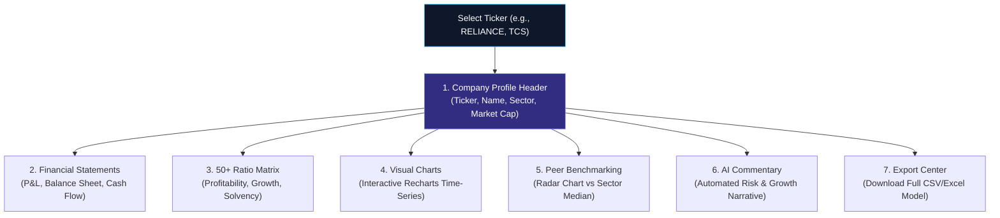
```mermaid
flowchart TD
    CompSelect["Select Ticker (e.g., RELIANCE, TCS)"] --> ProfileHeader["1. Company Profile Header\n(Ticker, Name, Sector, Market Cap)"]
    
    ProfileHeader --> Tab1["2. Financial Statements\n(P&L, Balance Sheet, Cash Flow)"]
    ProfileHeader --> Tab2["3. 50+ Ratio Matrix\n(Profitability, Growth, Solvency)"]
    ProfileHeader --> Tab3["4. Visual Charts\n(Interactive Recharts Time-Series)"]
    ProfileHeader --> Tab4["5. Peer Benchmarking\n(Radar Chart vs Sector Median)"]
    ProfileHeader --> Tab5["6. AI Commentary\n(Automated Risk & Growth Narrative)"]
    ProfileHeader --> Tab6["7. Export Center\n(Download Full CSV/Excel Model)"]

    style CompSelect fill:#0f172a,stroke:#38bdf8,color:#fff
    style ProfileHeader fill:#312e81,stroke:#818cf8,color:#fff
```

---

## 📄 Reports Module

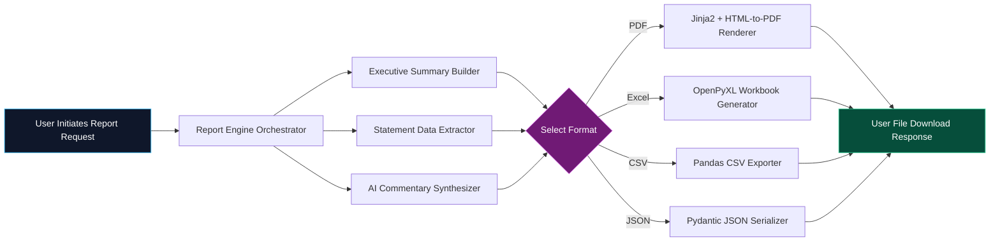
```mermaid
flowchart LR
    ReportReq["User Initiates Report Request"] --> RepEngine["Report Engine Orchestrator"]
    
    RepEngine --> ExecSum["Executive Summary Builder"]
    RepEngine --> FinState["Statement Data Extractor"]
    RepEngine --> AIRep["AI Commentary Synthesizer"]
    
    ExecSum & FinState & AIRep --> Formatter{"Select Format"}
    
    Formatter -->|PDF| PDFGen["Jinja2 + HTML-to-PDF Renderer"]
    Formatter -->|Excel| XLGen["OpenPyXL Workbook Generator"]
    Formatter -->|CSV| CSVGen["Pandas CSV Exporter"]
    Formatter -->|JSON| JSONGen["Pydantic JSON Serializer"]
    
    PDFGen & XLGen & CSVGen & JSONGen --> Download["User File Download Response"]

    style ReportReq fill:#0f172a,stroke:#38bdf8,color:#fff
    style Formatter fill:#701a75,stroke:#e879f9,color:#fff
    style Download fill:#064e3b,stroke:#34d399,color:#fff
```

---

## 📦 Dataset Relationship

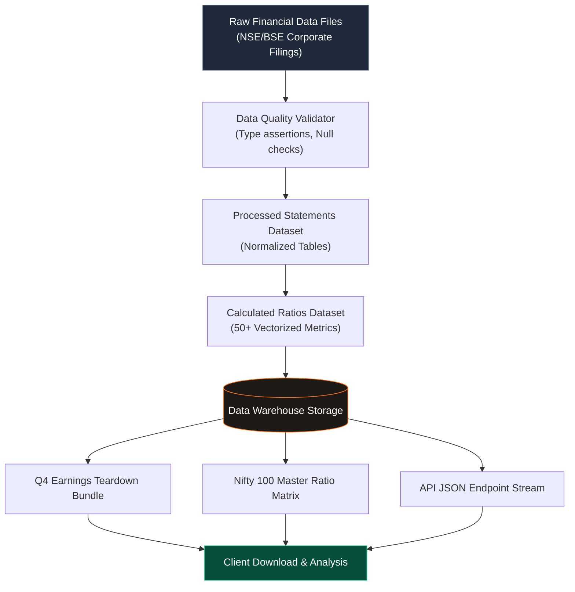
```mermaid
flowchart TD
    Raw["Raw Financial Data Files\n(NSE/BSE Corporate Filings)"] --> Val["Data Quality Validator\n(Type assertions, Null checks)"]
    Val --> Proc["Processed Statements Dataset\n(Normalized Tables)"]
    Proc --> Calc["Calculated Ratios Dataset\n(50+ Vectorized Metrics)"]
    Calc --> Store[("Data Warehouse Storage")]
    
    Store --> Export1["Q4 Earnings Teardown Bundle"]
    Store --> Export2["Nifty 100 Master Ratio Matrix"]
    Store --> Export3["API JSON Endpoint Stream"]

    Export1 & Export2 & Export3 --> Client["Client Download & Analysis"]

    style Raw fill:#1e293b,stroke:#64748b,color:#fff
    style Store fill:#1c1917,stroke:#f97316,color:#fff
    style Client fill:#064e3b,stroke:#34d399,color:#fff
```

---

## 🤖 AI Module

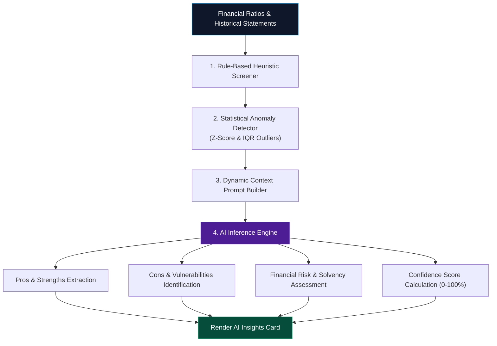
```mermaid
flowchart TD
    DataIn["Financial Ratios & Historical Statements"] --> RulesEngine["1. Rule-Based Heuristic Screener"]
    RulesEngine --> AnomalyEngine["2. Statistical Anomaly Detector\n(Z-Score & IQR Outliers)"]
    AnomalyEngine --> LLMPrompt["3. Dynamic Context Prompt Builder"]
    LLMPrompt --> AIModel["4. AI Inference Engine"]
    
    AIModel --> Out1["Pros & Strengths Extraction"]
    AIModel --> Out2["Cons & Vulnerabilities Identification"]
    AIModel --> Out3["Financial Risk & Solvency Assessment"]
    AIModel --> Out4["Confidence Score Calculation (0-100%)"]

    Out1 & Out2 & Out3 & Out4 --> UIWidget["Render AI Insights Card"]

    style DataIn fill:#0f172a,stroke:#38bdf8,color:#fff
    style AIModel fill:#4c1d95,stroke:#a78bfa,color:#fff
    style UIWidget fill:#064e3b,stroke:#34d399,color:#fff
```

### Anomaly Detection & AI Mechanics
1. **Statistical Z-Score Check:** Detects metrics that diverge more than $\pm 2\sigma$ from the sector median.
2. **Rule-Based Flagging:** Triggers warnings if Debt/Equity $> 2.0$ or Interest Coverage $< 1.5$.
3. **Contextual Synthesizer:** Generates plain-English narrative summaries detailing company strengths, weaknesses, and financial health scores.

---

## 💼 Portfolio Module

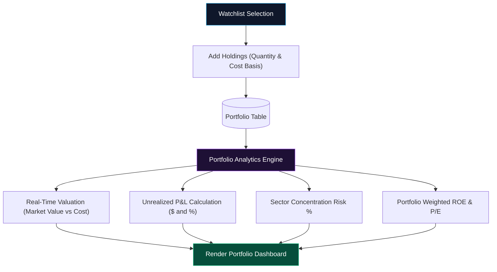
```mermaid
flowchart TD
    Watchlist["Watchlist Selection"] --> UserAdd["Add Holdings (Quantity & Cost Basis)"]
    UserAdd --> PortStore[("Portfolio Table")]
    
    PortStore --> Engine["Portfolio Analytics Engine"]
    Engine --> Calc1["Real-Time Valuation (Market Value vs Cost)"]
    Engine --> Calc2["Unrealized P&L Calculation ($ and %)"]
    Engine --> Calc3["Sector Concentration Risk %"]
    Engine --> Calc4["Portfolio Weighted ROE & P/E"]

    Calc1 & Calc2 & Calc3 & Calc4 --> UI["Render Portfolio Dashboard"]

    style Watchlist fill:#0f172a,stroke:#38bdf8,color:#fff
    style Engine fill:#1e1035,stroke:#a855f7,color:#fff
    style UI fill:#064e3b,stroke:#34d399,color:#fff
```

---

## ☁️ Deployment Diagram

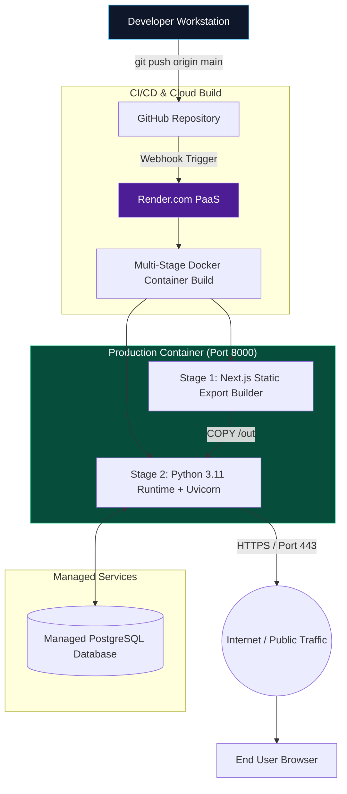
```mermaid
graph TD
    Dev["Developer Workstation"] -->|git push origin main| GitHub["GitHub Repository"]
    
    subgraph CI_CD ["CI/CD & Cloud Build"]
        GitHub -->|Webhook Trigger| Render["Render.com PaaS"]
        Render --> DockerBuild["Multi-Stage Docker Container Build"]
    end

    subgraph Container_Runtime ["Production Container (Port 8000)"]
        DockerBuild --> NodeStage["Stage 1: Next.js Static Export Builder"]
        DockerBuild --> PyStage["Stage 2: Python 3.11 Runtime + Uvicorn"]
        NodeStage -->|COPY /out| PyStage
    end

    subgraph Infrastructure ["Managed Services"]
        PyStage <--> DB[("Managed PostgreSQL Database")]
    end

    PyStage -->|HTTPS / Port 443| Internet(("Internet / Public Traffic"))
    Internet --> EndUser["End User Browser"]

    style Dev fill:#0f172a,stroke:#38bdf8,color:#fff
    style Render fill:#4c1d95,stroke:#a78bfa,color:#fff
    style Container_Runtime fill:#064e3b,stroke:#34d399,color:#fff
```

---

## 🎓 Complete Student Learning Path

For students and self-taught software engineers studying this repository, follow this recommended **10-Step Curriculum** to understand how enterprise financial software is designed:

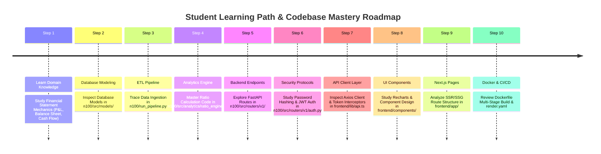
```mermaid
timeline
    title Student Learning Path & Codebase Mastery Roadmap
    Step 1 : Learn Domain Knowledge : Study Financial Statement Mechanics (P&L, Balance Sheet, Cash Flow)
    Step 2 : Database Modeling : Inspect Database Models in n100/src/models/
    Step 3 : ETL Pipeline : Trace Data Ingestion in n100/run_pipeline.py
    Step 4 : Analytics Engine : Master Ratio Calculation Code in n100/src/analytics/ratio_engine.py
    Step 5 : Backend Endpoints : Explore FastAPI Routes in n100/src/routers/v1/
    Step 6 : Security Protocols : Study Password Hashing & JWT Auth in n100/src/routers/v1/auth.py
    Step 7 : API Client Layer : Inspect Axios Client & Token Interceptors in frontend/lib/api.ts
    Step 8 : UI Components : Study Recharts & Component Design in frontend/components/
    Step 9 : Next.js Pages : Analyze SSR/SSG Route Structure in frontend/app/
    Step 10 : Docker & CI/CD : Review Dockerfile Multi-Stage Build & render.yaml
```

---

## 🎨 Comprehensive Mermaid Diagram Suite

### 1. System Mind Map

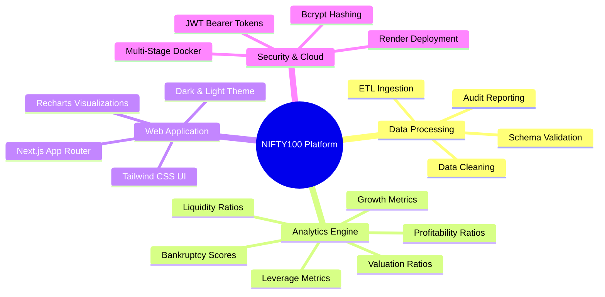
```mermaid
mindmap
  root((NIFTY100 Platform))
    Data Processing
      ETL Ingestion
      Schema Validation
      Data Cleaning
      Audit Reporting
    Analytics Engine
      Profitability Ratios
      Growth Metrics
      Liquidity Ratios
      Leverage Metrics
      Valuation Ratios
      Bankruptcy Scores
    Web Application
      Next.js App Router
      Tailwind CSS UI
      Recharts Visualizations
      Dark & Light Theme
    Security & Cloud
      JWT Bearer Tokens
      Bcrypt Hashing
      Multi-Stage Docker
      Render Deployment
```

### 2. User Journey Map

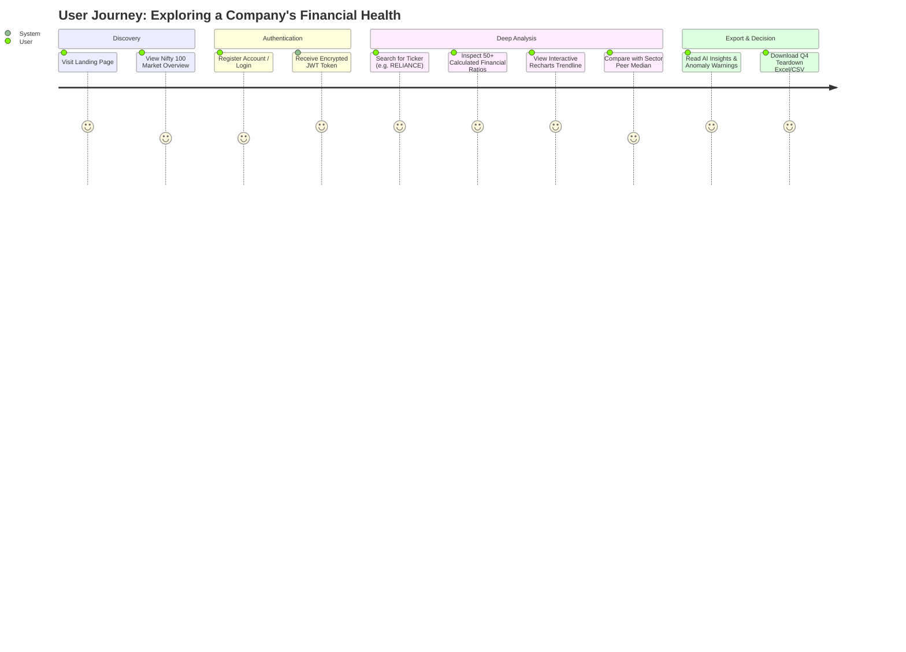
```mermaid
journey
    title User Journey: Exploring a Company's Financial Health
    section Discovery
      Visit Landing Page: 5: User
      View Nifty 100 Market Overview: 4: User
    section Authentication
      Register Account / Login: 4: User
      Receive Encrypted JWT Token: 5: System
    section Deep Analysis
      Search for Ticker (e.g. RELIANCE): 5: User
      Inspect 50+ Calculated Financial Ratios: 5: User
      View Interactive Recharts Trendline: 5: User
      Compare with Sector Peer Median: 4: User
    section Export & Decision
      Read AI Insights & Anomaly Warnings: 5: User
      Download Q4 Teardown Excel/CSV: 5: User
```

### 3. System State Diagram

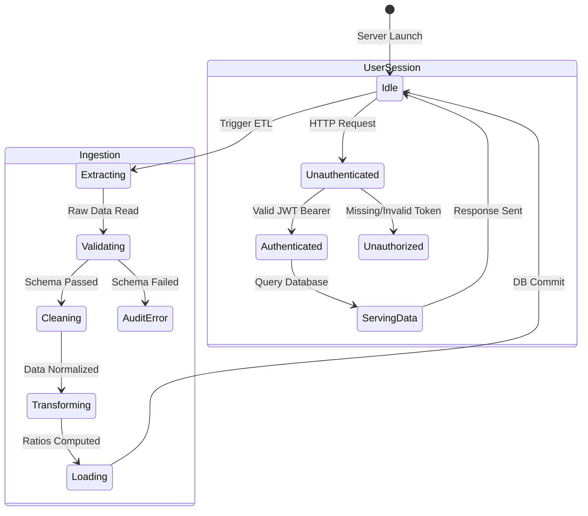
```mermaid
stateDiagram-v2
    [*] --> Idle: Server Launch

    state Ingestion {
        Idle --> Extracting: Trigger ETL
        Extracting --> Validating: Raw Data Read
        Validating --> Cleaning: Schema Passed
        Validating --> AuditError: Schema Failed
        Cleaning --> Transforming: Data Normalized
        Transforming --> Loading: Ratios Computed
        Loading --> Idle: DB Commit
    }

    state UserSession {
        Idle --> Unauthenticated: HTTP Request
        Unauthenticated --> Authenticated: Valid JWT Bearer
        Unauthenticated --> Unauthorized: Missing/Invalid Token
        Authenticated --> ServingData: Query Database
        ServingData --> Idle: Response Sent
    }
```

---

## 🛡️ Security & Enterprise Protocols

<div align="center">

| Security Domain | Standard / Mechanism | Implementation Detail |
|---|---|---|
| **Authentication** | JSON Web Tokens (JWT) | Cryptographically signed using HS256 / RS256 with 24-hour expiration windows. |
| **Password Storage** | Bcrypt Hashing | Passlib integration using key derivation function with cost factor 12. |
| **Data Validation** | Pydantic v2 Schemas | Strict type enforcement on all REST payloads preventing SQL Injection & Malformed JSON. |
| **Transport Security**| HTTPS / TLS 1.3 | Enforced automatically in cloud deployment via Render SSL termination. |
| **Resource Protection**| Role-Based Access Control | Strict permission separation between `admin`, `analyst`, and `viewer` user roles. |

</div>

---

## 🧪 Testing & Verification Protocol

### Running the Pytest Backend Test Suite

```bash
# Navigate to backend root
cd n100

# Activate virtual environment
source .venv/bin/activate   # Linux / macOS
.venv\Scripts\activate      # Windows

# Execute pytest suite with coverage output
pytest tests/ -v --cov=src --cov-report=term-missing
```

### Running Frontend Type Safety Checks

```bash
cd frontend

# Verify zero TypeScript compilation errors
npx tsc --noEmit

# Execute Next.js build step
npm run build
```

---

## 🤝 Contributing

We welcome open-source contributions from developers, data engineers, and financial analysts!

1. **Fork the Repository** on GitHub.
2. **Create a Feature Branch:** `git checkout -b feature/NewFinancialRatio`
3. **Commit Your Changes:** `git commit -m 'feat: add Dupont 3-step ratio breakdown engine'`
4. **Push to Your Branch:** `git push origin feature/NewFinancialRatio`
5. **Open a Pull Request** with a detailed explanation of your changes.

---

## 📜 License

This project is open-source and released under the **MIT License**.

```
MIT License — Copyright (c) 2024 Mallam Polaiah Ganesh

Permission is hereby granted, free of charge, to any person obtaining a copy
of this software and associated documentation files (the "Software"), to deal
in the Software without restriction, including without limitation the rights
to use, copy, modify, merge, publish, distribute, sublicense, and/or sell
copies of the Software, and to permit persons to whom the Software is
furnished to do so, subject to the following conditions:

The above copyright notice and this permission notice shall be included in all
copies or substantial portions of the Software.
```

---

## 👤 Author

<div align="center">


### **Mallam Polaiah Ganesh**
*Principal Financial Software Architect & Full-Stack Engineer*

[](https://github.com/MALLAMPOLAIAHGANESH)
[](https://linkedin.com/in/mallampolaiahganesh)

---

**⭐ Star this repository if you found it educational or useful for your projects!**

*Made with ❤️ for Financial Analytics, Software Engineering Students & Open Source Developers.*

</div>
